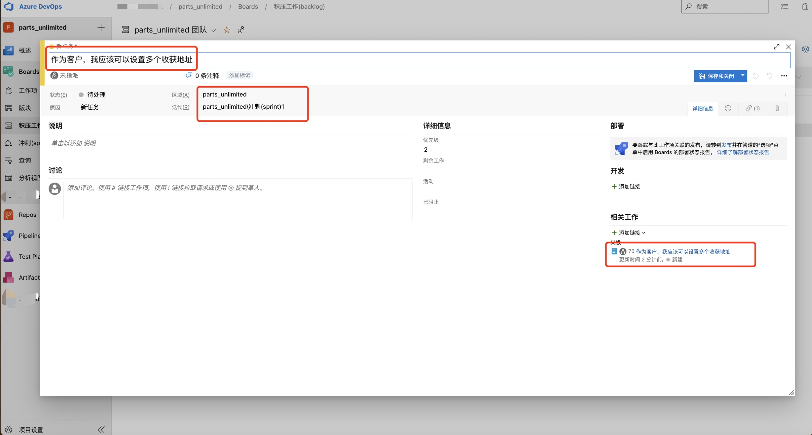

### Add Child Workitem for Azure DevOps
---
With this extension you can easily create child workitem on backlog/query/workitem context menu, especially for below scenarios.

 1. Add child workitem on backlogs page when filter enable.
 2. Add child workitem on query list.
 3. Add child workitem on workitem form page.
 4. Custom workitem parent-child relationship.

### Key Feature

|  Feature | Desc  |
| ------------ | ------------ |
| Add Child Workitem  | Quick create child workitem on backlog/query/workitem context menu  |
| Copy filed from parent workitem  | The child workitem will copy parent filed value (Title,Desc,Area,Iteration) automatically  |
| Global Configuration | Global workitem type relationship (Collection/Organization Level) |
| Project Configuration | Project-level workitem type relationship |

### User Guide
---

1. Global Configuration，Click Organization Settings | Add Child WorkItem
   

2. Setup the Parent-Child relationship.
   

### Project-Level Configuration（Optional）
---
1. Project-Level Configuration，Click Project Settings | Add Child WorkItem
   
2. Select the parent workitem type and child workitem type to setup the Parent-Child relationship。
   

### Add Child Workitem
1. Open Backlog page and click "Add child workitem" on the workitem right-click context menu.
   
2. As you can see, the child workitem will copy parent filed value (Title,Desc,Area,Iteration) automatically.
   
3. This feature also work in below scenarios.
- Workitem form context menu.
  
- Workitem card context menu.
  
- Workitem context menu on query list page.
  

###  Upcoming Features

|  Feature | Desc  |
| ------------ | ------------ |
|   Multiple child workitem type  | Config and select multiple child workitem type  |
|  Mapping fields | Custom filed mapping for Parent-Child workitem, so it will copy field value from parent workitem automatically |

### Bussiness Support && About Us
---
Please feel free to contact us by email: henryli@leansoftx.com

Leansoft dedicated in DevOps consulting, implementation, system integration, extension development, report design and other devops related solution. If you have any questions, please fell free to contact us with email above.

### Other extensions you may like

|  Name | Desc  |
| ------------ | ------------ |
| [Workitems Batch Copy](https://marketplace.visualstudio.com/items?itemName=leansoftx.ads-extension-batch-copy-wits)  | With this extension you can easily copy selected workitems (including child and linked workitems) to other Azure Devops Team Project |
| [Workitems Batch Link](https://marketplace.visualstudio.com/items?itemName=leansoftx.ads-extension-workitem-batch-link&ssr=false#overview)  | With this extension you can easily link selected workitems to other workitems from another team project (Support Cross-project, One-To-Many and Many-To-Many relationship)|
| [Pull Request Diff Copy](https://marketplace.visualstudio.com/items?itemName=leansoftx.pull-request-diff-copy)   | With this extension you can easily copy changed files to specifc folder for incremental deployment |
| [Unique Field Control](https://marketplace.visualstudio.com/items?itemName=leansoftx.ads-extension-field-validate)   | with this work item custom control, you can validate the uniqueness of work item field value before saving |

## Add Child WorkItem 插件介绍

---
此插件用于快速添加子级工作项。特别适用于以下场景快速创建子工作项。
 1. 积压工作列表数据量较大，Azure DevOps原生功能过滤数据后无法快速拆分子工作项。
 2. 查询列表中，无法快速拆分子工作项。
 3. 在工作项表单中，快速拆分子工作项。
 4. 自定义子工作项的结构关系。

子级工作项的类型可以进行自定义配置， 提供了 集合级 和 项目级 的两个配置入口， 分别在集合配置和项目配置页面的底部菜单。
集合级配置会在所有项目上生效，项目级配置优先级高于集合级的配置，只对当前团队项目生效。未配置的部分则默认使用上级的配置。
如果没有做任何配置，默认会添加一个相同类型的子级工作项。

### 功能列表

| 功能                   | 说明                                              |
|----------------------|-------------------------------------------------|
| 添加子级工作项              | 通过上下文菜单，添加子级工作项                                 |
| 自动关联父级工作项，并填充父级的默认字段 | 打开的新工作项默认和当前工作项建立上下级关联，并默认填充父级工作项的标题，描述，指派给基础字段 |
| 全局配置页面               | 配置工作项的的父子级类型，全局生效                               |
| 项目配置页面               | 配置工作项的的父子级类型，当前项目生效                             |

### 使用说明 - 集合级配置
---
1. 全局配置，进入集合配置页面，在底部找到Add Child WorkItem的菜单，点击进入配置页面
   

2. 分别输入 父级工作项类型，和子级工作项类型，点击提交按钮后，配置全局生效.
   

### 使用说明 - 项目级配置（可选）
---
1. 进入项目配置页面，在底部找到Add Child WorkItem的菜单，点击进入配置页面
   
2. 通过下拉列表，分别选择父级工作项类型，和子级工作项类型，最后点击提交按钮后，配置生效。
   
   

### 使用说明 - 添加子级工作项
1. 进入 Backlogs 工作项列表，选择任意工作项，右键打开上下文菜单，找到 “AddChildWorkItem”菜单后打开
   
2. 点击菜单后，打开子级工作项，图示区域中的字段默认从父级工作项上取得
   
3. 菜单的其它入口
- 工作项详情页右上角上下文菜单
  
- 看板中工作项右键上下文菜单
  
- 看板中工作项子级的上下文菜单
  
- 查询页面工作项上下文菜单
  

### 未来功能

|  功能 | 描述  |
| ------------ | ------------ |
| 多类型子任务  | 用户配置好多个子任务工作项类型后，可以选择需要创建的子任务工作项类型  |
| 自定义继承字段值 | 用户可以根据自己的业务流程，配置自己想从父级工作项中自动复制过来的字段值 |

### 商业支持 && 关于我们
---
如有任何问题可以通过邮件与我们联系：henryli@leansoftx.com

英捷创软致力于DevOps咨询，实施，插件开发，系统集成，报表度量设计等相关领域，至今已经为超过100家不同类型和规模的客户提供过ALM/DevOps解决方案的咨询和落地服务。 如您有任何DevOps相关的问题可以随时通过以上邮件与我们取得联系

### 其他插件

|  插件名称 | 插件描述  |
| ------------ | ------------ |
| [工作项批量复制](https://marketplace.visualstudio.com/items?itemName=leansoftx.ads-extension-batch-copy-wits)  | 工时项批量复制插件，可以方便快速的将项目下选中的工作项批量的复制到其他项目，对于需要将工作项复用到其他项目或移动到其他项目的场景非常有帮助 |
| [工作项批量链接](https://marketplace.visualstudio.com/items?itemName=leansoftx.ads-extension-workitem-batch-link)  | 工作项批量链接插件，可以方便快速的将当前项目下选择的工作项与其他项目的工作项建立链接，一键建立跨项目1对1，1对多，多对多的关联关系。 |
| [Pull Reqeust 变更文件复制](https://marketplace.visualstudio.com/items?itemName=leansoftx.pull-request-diff-copy)   | 当你使用Azure DevOps进行脚本或者静态资源的部署时，往往只需要更新或部署变更的文件，而不是部署所有的静态资源文件或者脚本文件。 比如HTML、JS、CSS、PHP、Python等文件或脚本。所以此插件非常适合增量部署等场景 |
| [工作项字段唯一性校验控件](https://marketplace.visualstudio.com/items?itemName=leansoftx.ads-extension-field-validate)   | 通过此工作项自定义控件，用户可以验证字段值的唯一性，避免出现在多个工作项上出现同一字段中存储相同值的问题 |